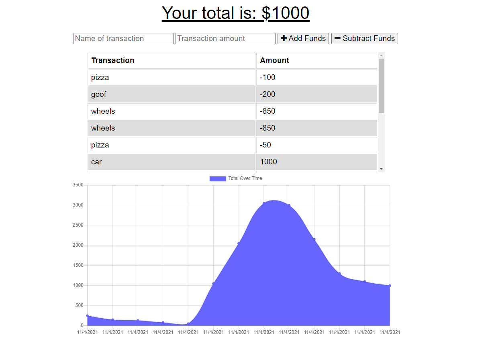
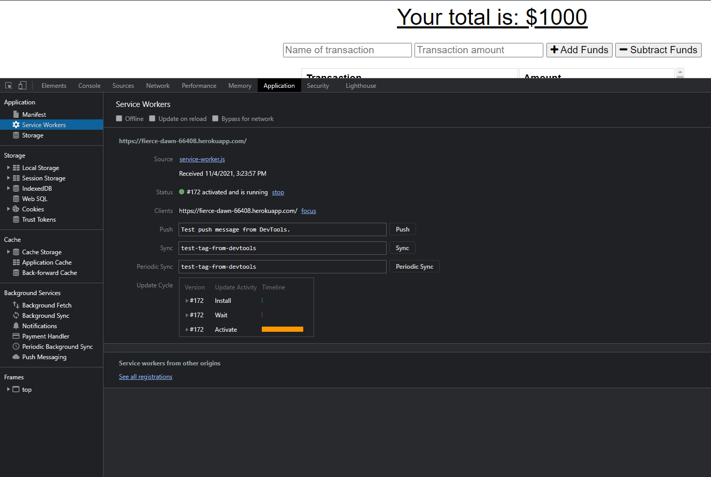

# online-offline-budget-tracker

Deployed: https://fierce-dawn-66408.herokuapp.com/

Repo: https://github.com/curriecoder/online-offline-budget-tracker

## Description

This application allows users to check an account balance and input subtractions and additions to the account. This project supports offline functionality in case the user is out of service, and then updates after the user comes back online. The motivation for this project was to develop a Progressive Web Application that can be installed locally on a user's device, leveraging a manifest, service-worker, and the cache api.

## Table of Contents

- [Installation](#installation)
- [Usage](#usage)
- [Credits](#credits)
- [License](#license)

## Installation

What are the steps required to install your project? Provide a step-by-step description of how to get the development environment running.

## Usage

To use this application, go to the deployed link and begin inputting expenses to track an account. This application can be used offline as well so it is especially convinient if the user needs to track finances in remote/serviceless areas.

## Credits

I would like to thank the instructor and support staff at the UPenn LPS Coding Bootcamp for their support and prioritization of the students. As always, thank you to the online community of web developers and the vast knowledge base that they have made available to those willing to look.

## License

MIT License

Copyright (c) [2021] [Andrew Currie]

Permission is hereby granted, free of charge, to any person obtaining a copy
of this software and associated documentation files (the "Software"), to deal
in the Software without restriction, including without limitation the rights
to use, copy, modify, merge, publish, distribute, sublicense, and/or sell
copies of the Software, and to permit persons to whom the Software is
furnished to do so, subject to the following conditions:

The above copyright notice and this permission notice shall be included in all
copies or substantial portions of the Software.

THE SOFTWARE IS PROVIDED "AS IS", WITHOUT WARRANTY OF ANY KIND, EXPRESS OR
IMPLIED, INCLUDING BUT NOT LIMITED TO THE WARRANTIES OF MERCHANTABILITY,
FITNESS FOR A PARTICULAR PURPOSE AND NONINFRINGEMENT. IN NO EVENT SHALL THE
AUTHORS OR COPYRIGHT HOLDERS BE LIABLE FOR ANY CLAIM, DAMAGES OR OTHER
LIABILITY, WHETHER IN AN ACTION OF CONTRACT, TORT OR OTHERWISE, ARISING FROM,
OUT OF OR IN CONNECTION WITH THE SOFTWARE OR THE USE OR OTHER DEALINGS IN THE
SOFTWARE.
---
